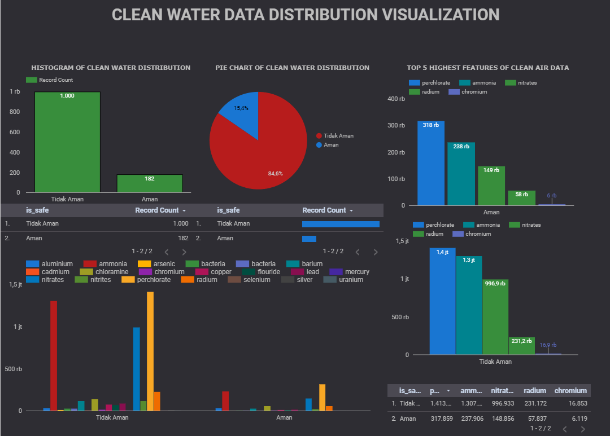

# 💧 Clean Water Data Distribution Dashboard

Interactive environmental data visualization built using Google Looker Studio to analyze clean water distribution and air quality indicators.

---

## 🔗 Live Dashboard

👉 [View Interactive Dashboard](https://lookerstudio.google.com/reporting/acbb7e2e-6ef9-4e86-bb46-1f7d0224a4f1)

---

## 📌 Project Overview

This dashboard analyzes clean water safety distribution and environmental quality indicators.

Main visualizations include:

- Histogram of Clean Water Distribution
- Pie Chart of Water Safety Classification
- Top 5 Highest Features of Clean Air Data
- Comparative Analysis of Safe vs Unsafe Water Records

The objective is to identify water safety patterns and key environmental factors contributing to clean water conditions.

---

## 📷 Dashboard Preview

---

## 📊 Key Insights

- Majority of records fall under "Unsafe" water classification.
- Clean water safety distribution is heavily skewed.
- Perchlorate and ammonia are among the highest contributing air quality indicators.
- Significant differences exist between safe and unsafe water conditions.

---

## 🛠 Tools & Skills Used

- Google Looker Studio
- Data Visualization
- Environmental Data Analysis
- Data Classification
- Comparative Feature Analysis
- Dashboard Design & Storytelling

---

## 🎯 Business / Environmental Use Case

This dashboard can support:

- Environmental monitoring agencies
- Public health analysis
- Water quality control departments
- Research & sustainability initiatives

It helps stakeholders quickly identify contamination patterns and prioritize corrective actions.

---

## 👤 Author

Mansel LN
