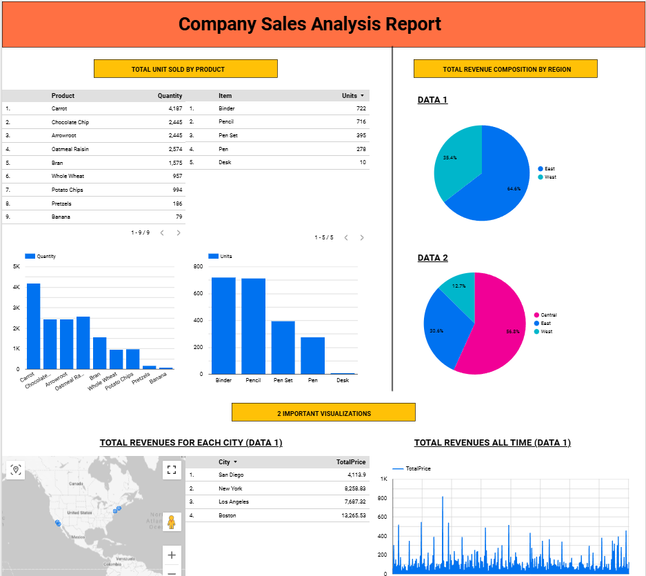

# Company Sales Performance Dashboard (Looker Studio)

Interactive sales analytics dashboard built using Google Looker Studio to analyze company-wide sales performance, revenue distribution, and product insights.

---

## Live Dashboard

👉 [View Interactive Dashboard](https://lookerstudio.google.com/reporting/a027ed9b-a3ab-4e58-8db1-b144eee6af04)

---

## Project Overview

This dashboard provides a comprehensive analysis of:

- Total Units Sold by Product
- Revenue Distribution by Region
- City-Level Revenue Analysis
- Revenue Trend Over Time
- Product Sales Comparison
- Regional Revenue Composition

The objective is to help stakeholders monitor sales performance and identify high-performing products and regions.

---

## Dashboard Preview

---

## Key Business Insights

- Certain products significantly outperform others in total units sold.
- Revenue distribution varies strongly across regions.
- City-level revenue shows uneven contribution patterns.
- Sales fluctuate over time with noticeable spikes.

---

## Tools & Skills Used

- Google Looker Studio
- Google Sheets (Data Source)
- Data Cleaning
- KPI Development
- Business Insight Analysis
- Data Visualization & Storytelling

---

## Business Problem

Companies need a centralized dashboard to:

- Monitor sales performance
- Identify top-selling products
- Understand regional revenue contribution
- Track revenue trends over time

This dashboard provides clear and actionable insights for decision-making.

---

## 👤 Author
Mansel L.N
Data Analyst
