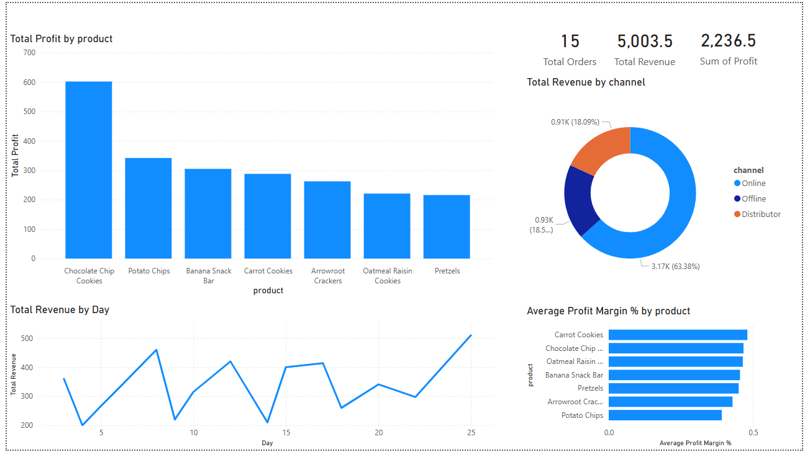

# Sales & Profit Performance Dashboard (Power BI)

Interactive Power BI dashboard analyzing sales performance, revenue distribution, and product profitability.

---

## Overview

This dashboard provides a comprehensive analysis of:

- Total Orders
- Total Revenue
- Total Profit
- Revenue by Channel (Online, Offline, Distributor)
- Profit by Product
- Average Profit Margin by Product
- Daily Revenue Trends

The report is designed to help stakeholders understand product performance, channel effectiveness, and overall business profitability.

---

## 📷 Dashboard Preview



---

## Key Insights

- Online channel contributes the highest revenue share.
- Chocolate Chip Cookies generate the highest total profit.
- Some products show higher profit margins despite lower total revenue.
- Revenue trends fluctuate across days with noticeable peaks.

---

## Tools Used

- Power BI
- Data Modeling (DAX Measures)
- Data Visualization
- Business KPI Analysis

---

## Project Structure

```
sales-profit-powerbi-dashboard/
│
├── Sales Dashboard.pbix
├── dataset.csv
├── dashboard.png
└── README.md
```

---

## KPIs Included

- Total Orders
- Total Revenue
- Total Profit
- Revenue by Channel
- Product Profit Comparison
- Average Profit Margin %
- Revenue by Day Trend

---

## Business Use Case

This dashboard can be used by:

- Sales Managers
- Business Analysts
- Product Managers
- Retail Strategy Teams

To monitor performance, identify profitable products, and optimize sales channels.
